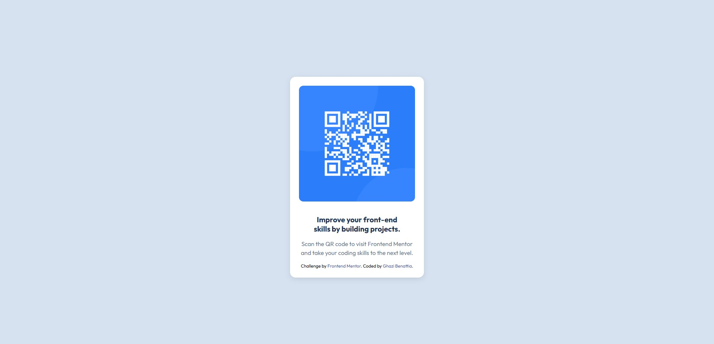
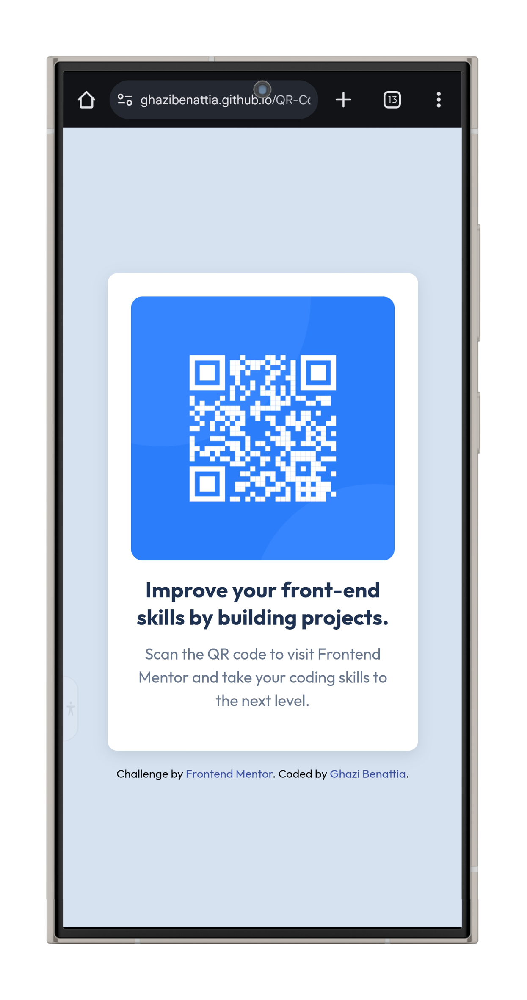
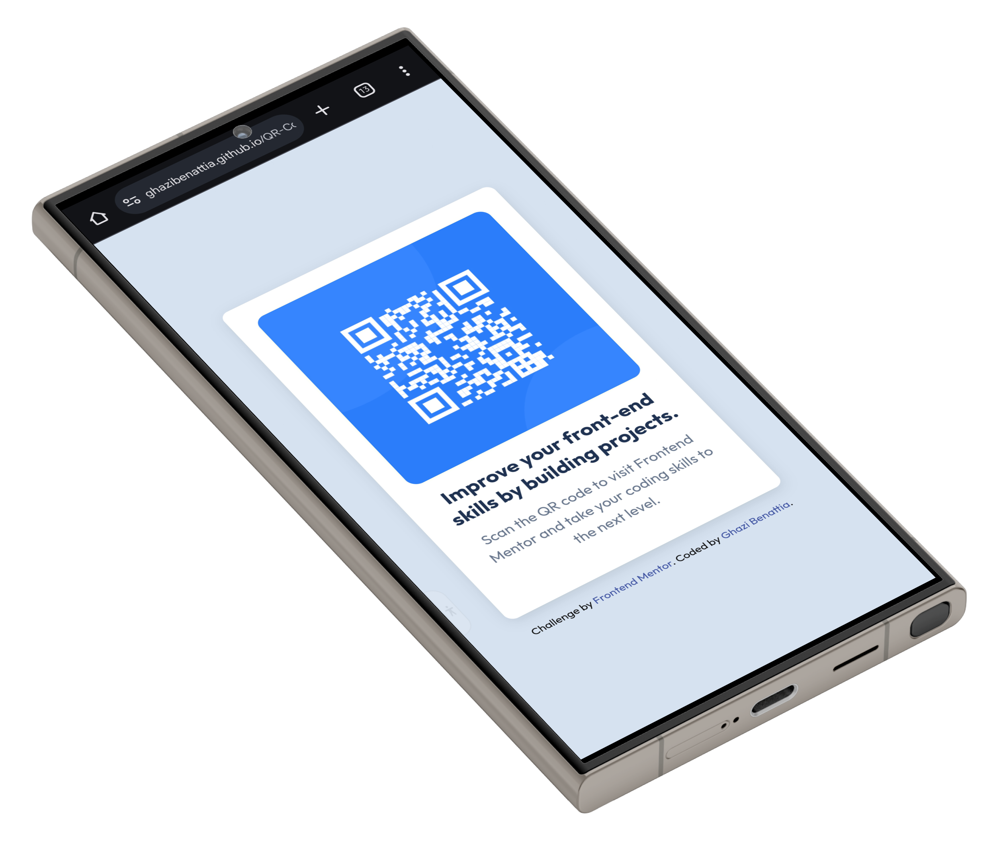

# Frontend Mentor - QR code component solution by Ghazi Benattia
This is a solution to the [QR code component challenge on Frontend Mentor](https://www.frontendmentor.io/challenges/qr-code-component-iux_sIO_H). Frontend Mentor challenges help you improve your coding skills by building realistic projects. 
***
## Table of contents
- [Overview](#overview)
  - [Screenshots](#screenshots)
  - [Links](#links)
- [My process](#my-process)
  - [Built with](#built-with)
  - [What I learned](#what-i-learned)
  - [Continued development](#continued-development)
  - [Useful resources](#useful-resources)
- [Author](#author)
- [Acknowledgments](#acknowledgments)
***
## Overview
Here's my solution to the QR Code Component challenge on FrontEnd Mentor.
***
### Screenshots
- How the website looks like in your laptop browser:

- Multiple phone design of the website:


---

### Links
- Solution URL: [Github repository](https://github.com/ghazibenattia/QR-Code-Component-Challenge-Solution)
- Live Site URL: [Live site using Github pages](https://ghazibenattia.github.io/QR-Code-Component-Challenge-Solution/)

---
## My process
As I'm just getting started as a frontend developer with no coding background whatsover, I was struggling at the beggining of this project but then as I got familiarized with using HTML and CSS it started getting easier. 
This project took me almost 5 hours and I'm proud of the progress I achieved.

---
### Built with
1. HTML5
2. External CSS
3. [Google Fonts](https://fonts.google.com/)
4. Flexbox: For centering content both vertically and horizontally.
5. HSL Color Model: For defining colors with Hue, Saturation, and Lightness.
6. Box Shadow: to add depth to the card.
7. Border Radius.
8. Responsive Design: To ensure that the layout adapts to different screen sizes.
9. Hover effects.
 
---

### What I learned
From working on this project, I learned the following key skills:
1. HTML5 Structure: I learned how to use semantic HTML5 elements to create a well-structured webpage (e.g., <header>, <footer>, <section>).
2. External CSS Linking: I learned how to link external stylesheets and organize my styles separately from the HTML content.
3. Responsive Design: I gained experience using flexbox and other CSS techniques to create layouts that adjust to different screen sizes, making the site mobile-friendly.
4. Typography & Google Fonts: I learned how to import and apply custom fonts from Google Fonts to improve the visual appearance of text.
5. CSS Styling: I applied properties like box-shadow, border-radius, and HSL color values to enhance the design with modern aesthetics.
6. User Interactivity: I added hover effects on links to improve user experience and engagement.
7. Visual Design Principles: I learned how to balance spacing, margins, and alignment to create a clean and readable design.

### Code snippets
Here are some code highlighted code snippets with a description:
1. **HTML Structure**
```html
<main><section><div class="card">...</div></section></main>
```
**Description: Used semantic HTML5 elements for a clear and accesible structure.**

---
2. **Centering with Flexbox**
```css
body {
    display: flex;
    align-items: center;
    justify-content: center;
    }
```
**Description: Centered the content using Flexbox for an easy alignment.**

---
3. **Image Styling:**
```css
.card img {
    width: 100%;
    border-radius: 12px;
}
```
**Description: Made the image responsive and gave it rounded corners.**

---
4. **Card Styling:**
```css
.card {
    padding: 1.5rem;
    box-shadow: 0 4px 15px rgba(0, 0, 0, 0.1);
    border-radius: 15px;
}
```
**Description: Styled the card with padding, shadow, and rounded corners for a clean design.**

---
5. **Google Fonts:**
```css
@import url('https://fonts.googleapis.com/css2?family=Outfit:wght@400;700&display=swap');
```
**Description: Imported the font "Outfit" to improve the website typography.**

---
6. **Hover Effect:**
```css
.attribution a:hover {
    text-decoration: underline;
}
```
**Description: Added an underline effect when hovering over the links for interactivity.**

---
### Continued development
For continued development, I plan to focus on refining my skills in responsive design, particularly in using Flexbox and CSS Grid for more complex layouts.
I also aim to deepen my understanding of advanced CSS techniques, such as animations and transitions, to enhance user interactivity. Additionally, I want to explore JavaScript integration for dynamic functionality and further improve my familiarity with web accessibility principles to ensure my projects are inclusive.
These areas will help me create even more polished and user-friendly websites in future projects.

---
### Useful resources
- [**Markdown Guide - Basic Syntax**](https://www.markdownguide.org/basic-syntax/) - This guide helped me learn how to format text in Markdown, including creating lists, links, and headers. It was essential for writing clear and structured documentation for my projects.
- [**Google Fonts**](https://fonts.google.com/) - I used Google Fonts to browse and integrate stylish fonts into my projects. It helped me improve the visual appeal of my work by giving me access to a variety of web-safe fonts.
- [**Net Ninja's GitHub Pages Tutorial (Youtube)**](https://www.youtube.com/watch?v=QyFcl_Fba-k) - This tutorial helped me understand how to use GitHub Pages to host my projects online. I learned how to deploy my static websites quickly and efficiently, which is perfect for showcasing my frontend work.
- [**W3Schools CSS Display Property Reference**](https://www.w3schools.com/cssref/pr_class_display.php) - I referred to this resource when I needed to understand how different **display** properties work in CSS. It helped me structure my layouts effectively using values like **block**, **inline**, **flex**, and **grid**.
- [**Atlassian Git Tutorial: Saving Changes**](https://www.atlassian.com/git/tutorials/saving-changes) - This tutorial taught me the basics of Git, specifically how to save my changes with commands like **git add**, **git commit**, and **git push**. It was a key resource for learning version control and managing my codebase.
- [**MDN Web Docs - Getting started with the Web**](https://developer.mozilla.org/en-US/docs/Learn/Getting_started_with_the_web) - This guide gave me a solid foundation in web development. It covered the basics of HTML, CSS, and JavaScript, which helped me understand how to build websites from scratch.
- [**web.dev Learn CSS**](https://web.dev/learn/css/) - This resource helped me dive deeper into CSS. I learned about layout techniques, responsive design, and how to write clean, efficient styles for my projects.
- [**web.dev Learn HTML**](https://web.dev/learn/html/) - This guide helped me understand the structure of web pages by teaching me about HTML elements and attributes. It gave me the knowledge to create semantic and accessible web pages.
---

## Author
- Github - [**Ghazi Benattia**](https://github.com/ghazibenattia)
- Frontend Mentor - [**@ghazibenattia**](https://www.frontendmentor.io/profile/ghazibenattia)
---

## Acknowledgments
I would like to extend my heartfelt gratitude to my two closest friends, Hazem Hosni and Oussema Bejaoui, whose inspiration and encouragement have been pivotal in launching my journey into development. Their unwavering support and belief in my potential motivated me to take the first steps in this exciting field. Thank you both for being such a great source of inspiration!